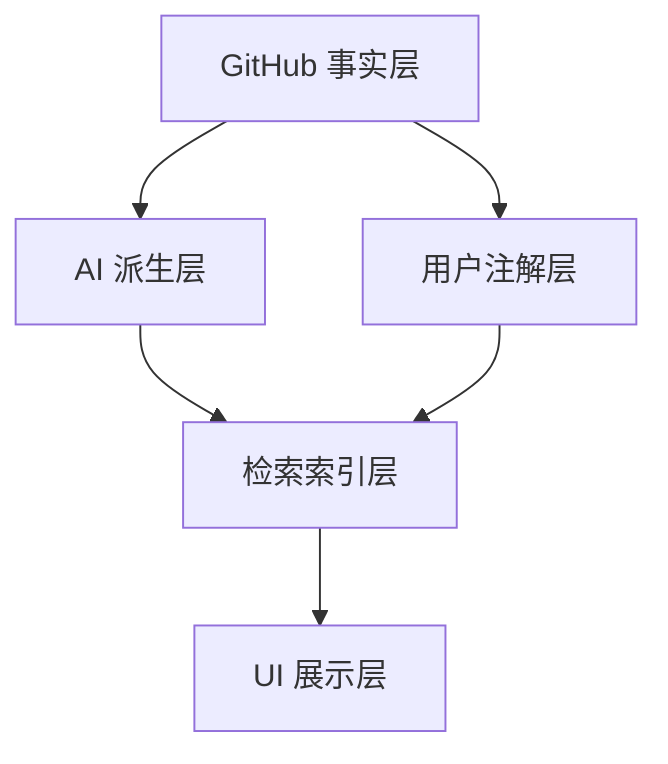

# 模块清单与职责边界

## 模块总览

| 模块 | 职责 | 输入 | 输出 | 边界约束 |
| --- | --- | --- | --- | --- |
| GitHub Sync | 授权、Star 同步、README 抓取、增量/全量对账 | GitHub Token、同步命令 | 仓库事实数据、README 原文 | 只写事实数据，不写 AI 派生结果 |
| Annotation Layer | 标签、笔记、收藏夹、批量整理 | 用户操作 | tags、notes、collections | 与 GitHub 事实数据分离 |
| Knowledge Pipeline | 摘要、README 中文梳理、关键词、标签建议 | README 原文、仓库元数据 | 中文摘要、README 中文梳理、关键词、推荐标签 | 可断点续跑，按内容 hash 幂等；Embedding 仅作为后续可选增强 |
| Search Engine | 关键词、过滤、本地知识检索、重排序 | 查询词、过滤条件 | 结果列表、匹配理由 | 不直接调用 GitHub，不直接调用 LLM 生成正文；当前不要求向量模型 |
| AI Service Layer | 摘要、标签网络、搜索计划、推荐计划、查询理解 | 标准化 AI 请求 | 标准化 AI 响应 | 屏蔽 OpenAI、OpenAI 兼容接口和 Anthropic 差异；Embedding 能力默认不启用 |
| Storage | 本地持久化、索引、任务状态 | 模块写入请求 | SQLite/FTS/可重建索引数据 | 数据分层，禁止混写；本机测试期旧库不迁移，结构不兼容时删除重建 |
| UI Workspace | Star 工作台、详情页、检索页、设置页 | 本地 API 数据 | 用户界面 | 所有可见文案必须可直接上线 |
| Sync Export | Gist/文件导入导出、备份恢复 | 注解层数据 | 备份文件或远端 Gist | 默认不上传 README 与 AI 派生内容 |

## 数据分层

### GitHub 事实层

保存 GitHub 返回的客观数据：

- `repo_id`
- `owner`
- `name`
- `full_name`
- `description`
- `language`
- `topics`
- `stars_count`
- `forks_count`
- `html_url`
- `starred_at`
- `pushed_at`
- `readme_raw`
- `readme_hash`

### 用户注解层

保存用户主观整理成果：

- 标签
- 笔记
- 收藏夹
- 已读/稍后看状态
- 人工评分
- 用户自定义别名

### AI 派生层

保存可重建的 AI 结果：

- 中文摘要
- 中文 README 译文
- 项目用途解释
- 推荐标签
- 关键词
- Embedding（后续可选增强，不是当前上线主链路）
- AI 处理状态
- 模型版本与 prompt 版本

## S.U.P.E.R 架构评估

| 原则 | 目标状态 | 风险 |
| --- | --- | --- |
| Single Purpose | 每个模块只有一个业务职责 | 如果 UI 直接调 GitHub/AI，会导致职责扩散 |
| Unidirectional Flow | GitHub 事实层 → AI 派生层 → 索引层 → UI | 如果检索结果回写事实层，会造成数据污染 |
| Ports over Implementation | GitHub、AI 与后续可选向量库都走统一端口 | 如果直接绑定单一模型或向量库，后续切换服务成本高 |
| Environment-Agnostic | 领域逻辑不依赖 Tauri/Electron/Web | 如果把业务逻辑写进桌面壳，Web 版无法复用 |
| Replaceable Parts | 存储、AI、后续可选向量检索可替换 | 如果早期 schema 不记录版本，后续发布版本升级困难 |

## 模块优先级

1. `Storage`：先确定数据分层，否则后续同步和 AI 结果会混乱。
2. `GitHub Sync`：先拿到稳定事实数据。
3. `Annotation Layer`：复刻原工具核心管理能力。
4. `Knowledge Pipeline`：构建 AI 知识库。
5. `Search Engine`：以 SQLite、README、AI 摘要、标签和笔记完成本地知识检索。
6. `UI Workspace`：围绕真实数据流构建体验。
