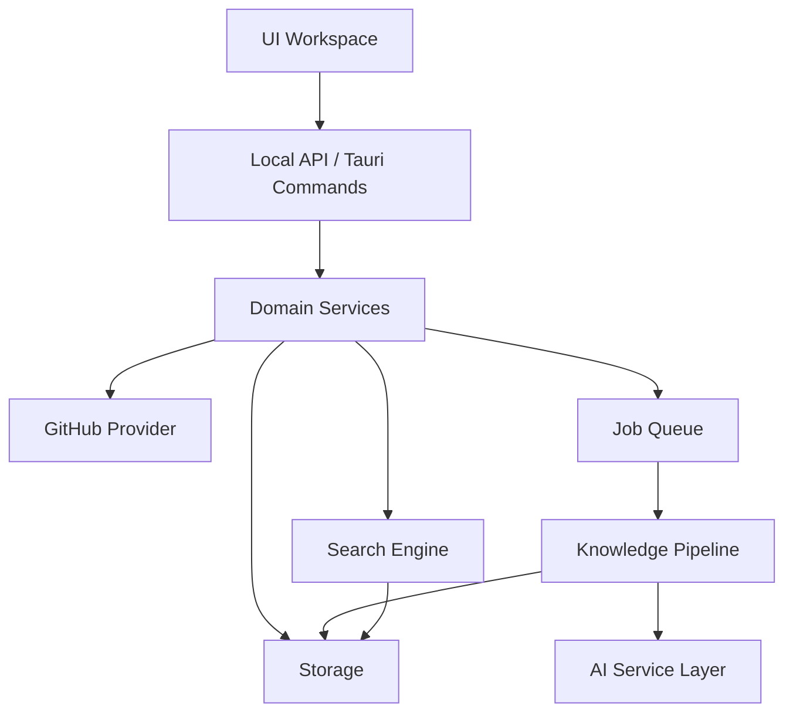
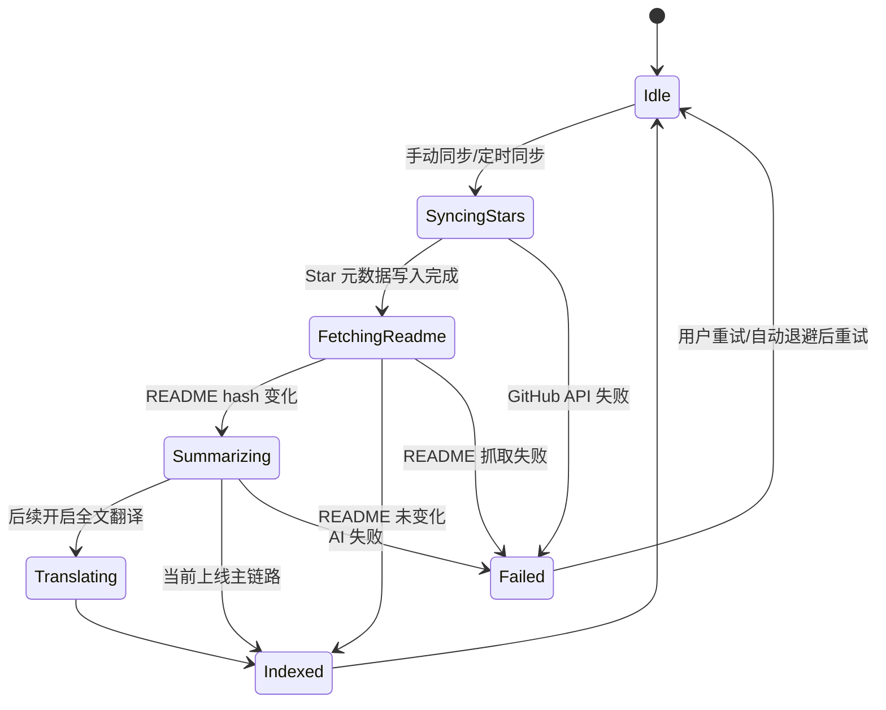

# 架构规格：GitHub-Stars-AI-Tools

## 架构原则

1. 事实数据、用户注解、AI 派生结果分层存储。
2. 同步、AI 处理、检索必须解耦。
3. Provider 必须可替换，不能让业务层绑定具体厂商 SDK。
4. MVP 优先本地闭环，云同步后置。
5. 所有长任务必须有状态机、重试和幂等键。

## 推荐技术栈

| 层 | 选择 | 说明 |
| --- | --- | --- |
| 桌面壳 | Tauri 2 | 本地优先、体积小、系统能力强 |
| 前端 | React 19 + Vite + TypeScript | 生态成熟，适合复杂工作台 |
| 路由 | 应用内页面状态 | 当前桌面端以轻量页面状态切换为主，后续再评估独立路由库 |
| 数据请求 | Tauri Commands + React 状态 | 通过本地 IPC 调用 Rust 能力，避免引入远端 API 层 |
| UI | Tailwind CSS + 项目内组件 | 统一 Material Symbols 图标、玻璃面板、响应式布局和深色模式 |
| 本地存储 | SQLite | 单用户本地数据稳定可靠 |
| 全文检索 | SQLite FTS5 | MVP 足够，维护成本低 |
| 向量检索 | zvec 或其他本地向量索引 | 后续可选增强，当前上线主链路不要求向量模型 |
| AI 服务适配层 | 统一 AI 请求接口 | 支持 OpenAI、OpenAI 兼容接口和 Anthropic |

## 目标目录结构

```text
apps/desktop/              # Tauri 桌面应用
apps/desktop/src/          # React UI
apps/desktop/src-tauri/    # Tauri/Rust 桌面壳
packages/domain/           # 领域模型、状态机、查询 DSL
packages/github/           # GitHub 数据适配
packages/ai/               # AI 服务适配层
packages/storage/          # SQLite schema、初始化、Repository
packages/search/           # FTS、本地知识检索、后续可选向量检索
packages/worker/           # 同步、README、AI 处理任务
packages/ui/               # 共享 UI 组件
docs/                      # spec、计划、进度
```

## 核心模块关系



## 数据模型草案

### `github_accounts`

| 字段 | 说明 |
| --- | --- |
| `id` | 本地账号 ID |
| `login` | GitHub 用户名 |
| `avatar_url` | 头像 |
| `token_ref` | 系统 Keychain 引用，不存明文 |
| `created_at` | 创建时间 |
| `updated_at` | 更新时间 |

### `repositories`

| 字段 | 说明 |
| --- | --- |
| `id` | GitHub repo id |
| `account_id` | 账号 ID |
| `owner` | owner |
| `name` | repo name |
| `full_name` | owner/name |
| `description` | GitHub 描述 |
| `language` | 主语言 |
| `topics_json` | topics |
| `html_url` | GitHub 地址 |
| `stars_count` | star 数 |
| `forks_count` | fork 数 |
| `starred_at` | 用户 star 时间 |
| `pushed_at` | 仓库最近 push 时间 |
| `sync_status` | active/removed/gone/error |

### `repo_readmes`

| 字段 | 说明 |
| --- | --- |
| `repo_id` | 仓库 ID |
| `content_raw` | README 原文 |
| `content_hash` | 内容 hash |
| `source_path` | README 路径 |
| `fetched_at` | 抓取时间 |

### `repo_ai_documents`

| 字段 | 说明 |
| --- | --- |
| `repo_id` | 仓库 ID |
| `summary_zh` | 中文摘要 |
| `readme_zh` | 中文全文译文，后续增强 |
| `keywords_json` | 关键词 |
| `suggested_tags_json` | AI 推荐标签 |
| `model` | 模型名 |
| `prompt_version` | prompt 版本 |
| `source_hash` | 来源 README hash |
| `generated_at` | 生成时间 |

### `annotations`

| 字段 | 说明 |
| --- | --- |
| `repo_id` | 仓库 ID |
| `account_id` | 账号 ID |
| `note_md` | 用户笔记 |
| `rating` | 用户评分 |
| `read_status` | unread/read/later |
| `updated_at` | 更新时间 |

### `tags` 与 `repo_tags`

保存用户标签及仓库标签关系。

### `jobs`

| 字段 | 说明 |
| --- | --- |
| `id` | 任务 ID |
| `type` | sync_stars/fetch_readme/summarize/translate，embed 仅用于后续可选向量索引 |
| `payload_json` | 任务参数 |
| `status` | pending/running/succeeded/failed/skipped |
| `idempotency_key` | 幂等键 |
| `retry_count` | 重试次数 |
| `last_error` | 最近错误 |

## 同步状态机



## AI 服务接口

```ts
// 伪代码：业务层只能依赖这个端口，不依赖具体模型 SDK
export interface AiProvider {
  summarizeReadme(input: SummarizeInput): Promise<SummaryResult>;
  translateReadme(input: TranslateInput): Promise<TranslateResult>;
  embed?(input: EmbedInput): Promise<EmbeddingResult>;
  understandQuery(input: QueryInput): Promise<QueryUnderstanding>;
}
```

当前实现：

- `OpenAI` 官方接口
- `OpenAI-compatible` 兼容 Chat Completions 的第三方接口
- `Anthropic` Claude Messages API

知识库 AI 的聊天配置与 Embedding 配置相互独立。向量检索默认关闭，只有用户主动启用后，自然语言搜索和索引重建才会调用 OpenAI 兼容 Embeddings 接口；README 摘要、标签网络和 GitHub 相似推荐仍只使用聊天协议。

后续新增服务时继续挂在同一适配层，不把模型 SDK 直接暴露给 UI。

## 查询 DSL

```ts
// 伪代码：UI、自然语言检索和普通筛选都统一转换成 RepoQuery
export type RepoQuery = {
  text?: string;
  naturalLanguage?: string;
  languages?: string[];
  tags?: string[];
  topics?: string[];
  readStatus?: 'unread' | 'read' | 'later';
  sort?: 'relevance' | 'starred_at' | 'updated_at' | 'name';
  limit: number;
  offset: number;
};
```

## 检索策略

基础检索：

1. `repositories` 元数据过滤。
2. `SQLite FTS5` 检索 name、description、topics、note、summary_zh。
3. 结合 README 缓存、AI 摘要、标签、笔记和最近对话上下文返回中文匹配理由。
4. 未启用 Embedding 时不生成 query embedding。

zvec 混合检索：

1. 用户启用并配置 Embedding 后生成 query embedding。
2. FTS 与向量双路召回。
3. 合并候选。
4. 用规则或 reranker 重排序。
5. 返回中文匹配解释和 README 引用片段。

所有检索先执行对话意图门控；融合结果默认 8 条、硬上限 10 条。AI 可用时只把最终候选的仓库名、描述、Topics 和摘要用于回答生成，用户笔记保持本地。

## README 中文化策略

- 先摘要，后全文翻译。
- 内容 hash 不变不重复处理。
- 代码块、命令、URL 不翻译。
- 长 README 按 Markdown 标题分块。
- 每个 AI 结果记录 `model`、`prompt_version`、`source_hash`。

## 安全策略

- GitHub Token 存系统 Keychain。
- AI Key 存系统 Keychain。
- 默认不把用户 notes 发给 AI。
- 日志不写 Authorization、Token、Cookie。
- 导出文件不默认包含 Token 和 AI Key。
