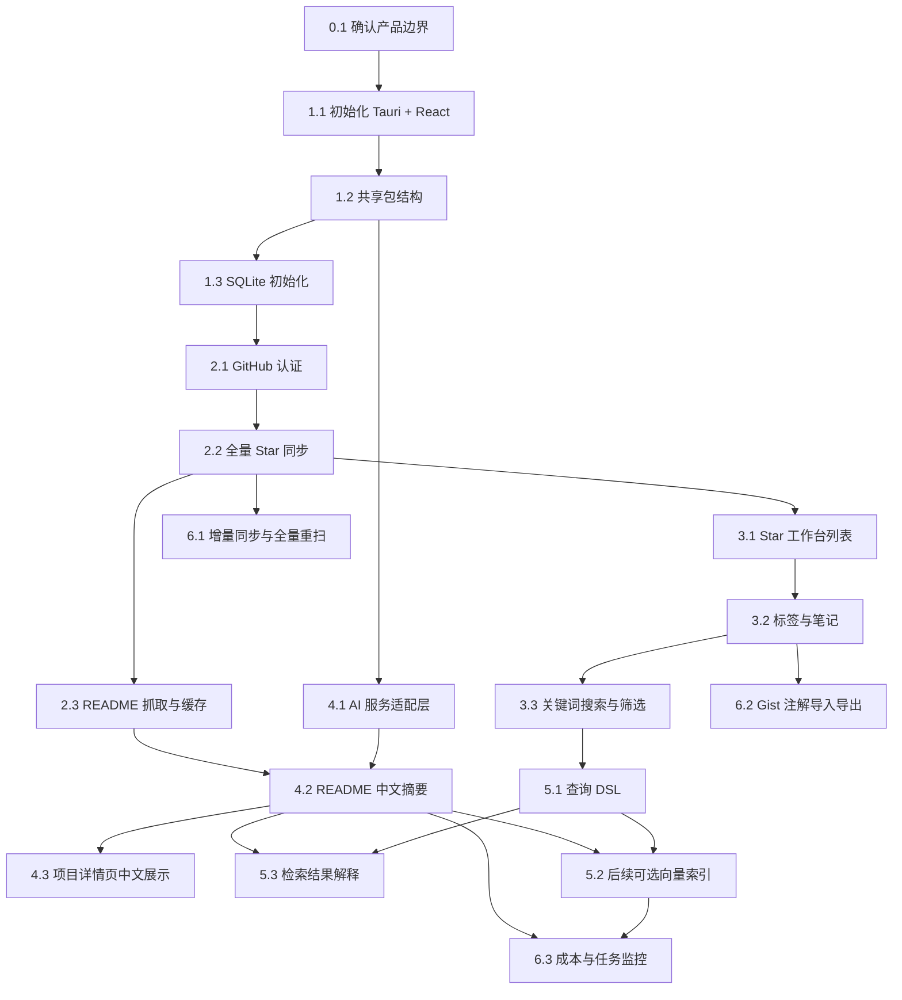
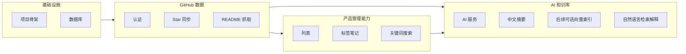

# 依赖图

```mermaid
flowchart TD
  T01[0.1 确认产品边界] --> T11[1.1 初始化 Tauri + React]
  T11 --> T12[1.2 共享包结构]
  T12 --> T13[1.3 SQLite 初始化]

  T13 --> T21[2.1 GitHub 认证]
  T21 --> T22[2.2 全量 Star 同步]
  T22 --> T23[2.3 README 抓取与缓存]

  T22 --> T31[3.1 Star 工作台列表]
  T31 --> T32[3.2 标签与笔记]
  T32 --> T33[3.3 关键词搜索与筛选]

  T12 --> T41[4.1 AI 服务适配层]
  T23 --> T42[4.2 README 中文摘要]
  T41 --> T42
  T42 --> T43[4.3 项目详情页中文展示]

  T33 --> T51[5.1 查询 DSL]
  T42 --> T53[5.3 检索结果解释]
  T51 --> T53
  T42 --> T52[5.2 后续可选向量索引]
  T51 --> T52

  T22 --> T61[6.1 增量同步与全量重扫]
  T32 --> T62[6.2 Gist 注解导入导出]
  T42 --> T63[6.3 成本与任务监控]
  T52 --> T63
```

## 并行泳道

```mermaid
flowchart LR
  subgraph LaneA[基础设施]
    A1[项目骨架]
    A2[数据库]
  end

  subgraph LaneB[GitHub 数据]
    B1[认证]
    B2[Star 同步]
    B3[README 抓取]
  end

  subgraph LaneC[产品管理能力]
    C1[列表]
    C2[标签笔记]
    C3[关键词搜索]
  end

  subgraph LaneD[AI 知识库]
    D1[AI 服务]
    D2[中文摘要]
    D3[后续可选向量索引]
    D4[自然语言检索解释]
  end

  LaneA --> LaneB
  LaneB --> LaneC
  LaneB --> LaneD
  LaneC --> LaneD
```
